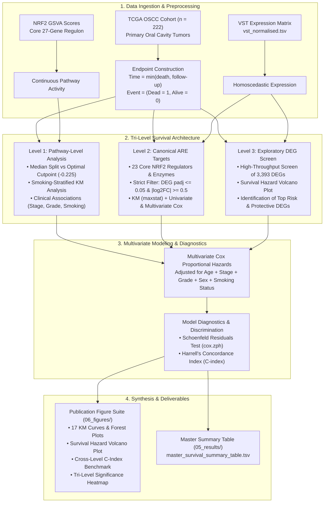

# Survival Association Analysis (Section 2.2) — Comprehensive Methodology Guide
**Project**: KEAP1–NRF2 Signalling Axis and Redox Homeostasis in Oral Squamous Cell Carcinoma (OSCC)  
**Dataset**: TCGA-HNSC (Oral Cavity Subset, $n = 222$ primary OSCC patients with matched transcriptomic and clinical follow-up data; 98 overall survival events)  
**Primary Script**: [`08_scripts/05_survival_analysis/survival_analysis_hub_genes.R`](file:///c:/Users/dipak/Desktop/Riku/NyberMan/KEAP1_NRF2_OSCC_Project/08_scripts/05_survival_analysis/survival_analysis_hub_genes.R)  
**Output Directories**: 
- Results & Tables: [`05_results/05_survival_analysis/`](file:///c:/Users/dipak/Desktop/Riku/NyberMan/KEAP1_NRF2_OSCC_Project/05_results/05_survival_analysis/)
- Publication Figures: [`06_figures/05_survival_analysis/`](file:///c:/Users/dipak/Desktop/Riku/NyberMan/KEAP1_NRF2_OSCC_Project/06_figures/05_survival_analysis/)

---

## 1. Executive Summary

Survival analysis is the statistical gold standard in cancer systems biology for evaluating whether molecular alterations—such as pathway activation signatures, canonical transcriptional effectors, or downstream differentially expressed genes—are significantly associated with patient mortality over time.

In Section 2.2 of the KEAP1–NRF2 OSCC project, we execute a **Tri-Level Survival Architecture** designed to evaluate prognostic impact across three hierarchical biological layers while rigorously accounting for clinical confounders:

1. **Level 1 (Primary): Pathway-Level Prognostic Stratification (NRF2 GSVA Score)**:
   - Evaluates whether overall NRF2 transcriptional activity (captured via Gene Set Variation Analysis [GSVA] of the core Antioxidant Response Element [ARE] regulon) predicts overall survival (OS).
   - Contrasts unsupervised median and tertile splits against data-driven **optimal cutpoint determination** via maximally selected rank statistics (`maxstat`), identifying the precise threshold at which antioxidant hyperactivation confers clinical risk.
   - Evaluates the **biological interaction with tobacco smoking**, testing whether NRF2 prognostic divergence differs between reactive oxygen species (ROS)-exposed smoker tumors versus lifelong non-smoker tumors.
   - Correlates continuous NRF2 activity with clinical covariates (AJCC stage, histologic grade, gender, and smoking status).

2. **Level 2 (Secondary): Canonical NRF2 Pathway Regulators and Key Target DEGs**:
   - Focuses on 23 core canonical NRF2 pathway genes (oxidative stress sensors, antioxidant enzymes, NADPH-generating metabolic enzymes, and Phase II/III detoxification transporters) strictly filtered to differentially expressed genes (DEGs) between NRF2-High and NRF2-Low tumors ($|\log_2\text{FC}| \ge 0.5$, $p_{\text{adj}} \le 0.05$).
   - Fits Kaplan–Meier curves (optimal cutpoints) and continuous univariate Cox models to identify which specific effectors drive mortality.
   - Fits multivariable Cox regression adjusting for age, stage, grade, sex, and tobacco smoking history to establish **independent canonical prognostic biomarkers** (identifying NQO1 as the sole independent canonical risk effector).

3. **Level 3 (Exploratory): Genome-Wide Screen of NRF2-Associated DEGs**:
   - Conducts an unbiased, high-throughput univariate Cox regression screen across all 3,393 candidate DEGs associated with NRF2 hyperactivation.
   - Employs a novel **Survival Hazard Volcano Plot** ($\log_2\text{HR}$ vs. $-\log_{10}p$) to systematically segregate downstream effectors into adverse (risk) and favorable (protective) prognostic classes.
   - Identifies candidate non-canonical effectors (such as the neuroendocrine calcium channel subunit *CACNA1A* and developmental transcription factor *PITX2*) that mediate or modulate the clinical phenotype.

4. **Cross-Level Diagnostics, Discrimination & Synthesis**:
   - Verifies the Cox proportional hazards assumption across all models using **scaled Schoenfeld residuals** (`survival::cox.zph`).
   - Benchmarks incremental predictive discrimination across analytical levels against a baseline clinical model using **Harrell's Concordance Index ($C$-index)**.
   - Synthesizes all findings into a unified **Tri-Level Integrative Survival Significance Matrix** and a comprehensive **Master Survival Summary Table**.

---

## 2. Fundamental Concepts of Survival Analysis (A Primer from First Principles)

### 2.1 Why Not Standard Linear Regression or T-Tests?
In conventional biomedical experiments, researchers measure fixed binary or continuous endpoints (e.g., tumor volume at 4 weeks or remission status at 6 months). In clinical oncology, however, observational outcome data exhibit two unique properties that violate the core assumptions of standard linear regression, ANOVA, or logistic regression:

1. **Time-to-Event Nature**: We care not simply *whether* a patient died, but *when* the death occurred. A therapeutic intervention or gene expression profile that delays death by 5 years is clinically superior to one that delays it by 3 months, even if both patients eventually pass away. Logistic regression collapses this temporal dimension into a simple binary yes/no, discarding critical survival time information.
2. **Right-Censoring**: At the conclusion of a clinical study, a substantial proportion of patients remain alive, or some patients relocate and become lost to follow-up. For these individuals, the exact time of death is unobserved. We know only that they survived *at least* until their last clinic visit (e.g., 1,500 days), after which their status is right-censored. 
   - Discarding censored patients would introduce extreme survivor bias, falsely inflating the cohort mortality rate.
   - Treating the last follow-up time as the time of death would falsely underestimate survival times.

Survival analysis provides the mathematical framework to incorporate both uncensored events and right-censored follow-up times without introducing bias.

```
Patient 1: ────[Diagnosis]──────────────────────────(Death at Day 450)           → Event = 1, Time = 450d
Patient 2: ────[Diagnosis]──────────────────────────────────────[Last FU 1500d]  → Event = 0, Time = 1500d (Censored)
Patient 3: ────[Diagnosis]────────[Lost to follow-up 320d] (Alive)              → Event = 0, Time = 320d  (Censored)
```

---

### 2.2 Mathematical Terminology

#### 1. Survival Time ($T$) and Event Indicator ($\delta$)
For each patient $i$ in the cohort:
- **Survival Time ($T_i$)**: The observed duration from the date of initial pathologic diagnosis to the date of the event (death) or the date of last clinical follow-up.
- **Event Status ($\delta_i$)**: A binary indicator variable defined as:
  $$\delta_i = \begin{cases} 1 & \text{if the Event occurred (Patient died of any cause)} \\ 0 & \text{if Censored (Patient was alive at last documented follow-up)} \end{cases}$$

#### 2. The Survival Function $S(t)$
The survival function $S(t)$ denotes the probability that a patient's survival time $T$ exceeds a specified time $t$:
$$S(t) = P(T > t), \quad \text{where } S(0) = 1 \text{ and } \lim_{t \to \infty} S(t) = 0$$
Empirically, $S(t)$ represents the proportion of the initial cohort remaining alive at time $t$.

#### 3. The Hazard Function $h(t)$
The hazard function $h(t)$, also called the instantaneous failure rate, quantifies the conditional probability of dying in the infinitesimal interval $[t, t + \Delta t)$, given that the patient has survived up to time $t$:
$$h(t) = \lim_{\Delta t \to 0} \frac{P(t \le T < t + \Delta t \mid T \ge t)}{\Delta t}$$
While $S(t)$ reflects cumulative survival probabilities over time, $h(t)$ reflects the immediate, instantaneous risk of mortality at time $t$.

---

## 3. Data Preparation and Cohort Construction

The analysis merges two primary data streams derived from the TCGA-HNSC project:

1. **Normalized Transcriptomic Matrix** (`01_data/processed/vst_normalised.tsv`):
   - High-throughput RNA-sequencing read counts normalized using DESeq2's **Variance-Stabilizing Transformation (VST)**.
   - VST eliminates the mean-variance dependency across dynamic expression ranges, producing homoscedastic continuous $\log_2$-scale expression values suitable for linear modeling and Cox regression.
2. **Clinical and Pathway Metadata** (`01_data/processed/metadata_nrf2_classified.tsv`):
   - Patient-level clinical records curated with longitudinal follow-up, vital status, and clinicopathological covariates.
   - Single-sample **NRF2 GSVA Scores** computed via Gene Set Variation Analysis (`GSVA::gsva`, Gaussian kernel) across the 27-gene core canonical NRF2 regulon.

```
┌────────────────────────────────────────────────────────┐
│ TCGA-HNSC Oral Cavity Cohort (ICD-10 C02–C06)          │
│ Subsites: Oral Tongue, Floor of Mouth, Alveolar Ridge, │
│ Hard Palate, and Buccal Mucosa                         │
└──────────────────────────┬─────────────────────────────┘
                           │ Filter: Primary Solid Tumors (Condition == "Tumor")
                           │ Deduplicate: 1 sample per patient Case ID
                           │ Verify: Valid positive follow-up duration (> 0 days)
                           ▼
┌────────────────────────────────────────────────────────┐
│ Complete Analytic Survival Cohort (n = 222 patients)   │
├────────────────────────────────────────────────────────┤
│ • Overall Survival Events (Dead): n = 98 (44.1%)       │
│ • Censored Observations (Alive):  n = 124 (55.9%)      │
│ • Median Follow-up Duration:      1.96 years           │
└──────────────────────────┬─────────────────────────────┘
                           │ Merge VST Expression & Clinical Annotations
                           ▼
┌────────────────────────────────────────────────────────┐
│ Analytical Data Frame: Surv(os_time_years, os_event)   │
│ Model Predictors: NRF2 Score, Canonical DEGs, DEGs     │
│ Covariates: Age + Stage + Grade + Sex + Smoking Status  │
└────────────────────────────────────────────────────────┘
```

### 3.1 Endpoint Definition
- **Overall Survival (OS)** is selected as the primary clinical endpoint:
  $$\text{OS Time (days)} = \begin{cases} \text{demographic.days\_to\_death} & \text{if } \text{demographic.vital\_status} == \text{"Dead"} \\ \text{diagnoses.days\_to\_last\_follow\_up} & \text{if } \text{demographic.vital\_status} == \text{"Alive"} \end{cases}$$
- For clinical clarity and standardized modeling, time is expressed in years:
  $$\text{OS Time (years)} = \frac{\text{OS Time (days)}}{365.25}$$

---

## 4. Analytical Method 1: Kaplan–Meier (KM) Survival Curves

### 4.1 Concept and Formula
The Kaplan–Meier estimator is a non-parametric statistic used to estimate the cumulative survival function $\hat{S}(t)$ directly from observed event times without assuming an underlying parametric distribution (such as Weibull or exponential):
$$\hat{S}(t) = \prod_{t_i \le t} \left( 1 - \frac{d_i}{n_i} \right)$$
Where:
- $t_i$: Distinct calendar time at which one or more deaths occur.
- $d_i$: Number of deaths occurring exactly at time $t_i$.
- $n_i$: Number of patients known to be alive and at risk immediately prior to $t_i$ (total patients minus previous deaths and censored individuals).

KM curves generate stepped survival plots, where vertical steps mark patient deaths and vertical tick marks denote censored individuals.

---

### 4.2 Optimal Cutpoint Determination (Maximally Selected Rank Statistics)
To construct a Kaplan–Meier survival curve for a continuous molecular variable (such as an NRF2 GSVA score or single-gene VST expression), patients must be dichotomized into **High** vs. **Low** expression groups.

- **Limitations of Traditional Median Splits**: Standard practice frequently utilizes an unsupervised median split ($50\% / 50\%$). However, if a biological oncogene triggers adverse clinical behavior only when expressed at high levels (e.g., above the 60th percentile), a median split pools moderately-expressing patients into the "High" group, diluting the prognostic separation and frequently causing type II errors (false negatives).
- **Our Implementation (`survminer::surv_cutpoint` / `maxstat`)**:
  - The algorithm evaluates candidate cutpoints $c$ across the continuous expression spectrum between the 20th and 80th percentiles (`minprop = 0.20` for Level 1, `minprop = 0.25` for Level 2 and Level 3).
  - At each candidate threshold $c$, the cohort is partitioned into two strata ($X < c$ and $X \ge c$), and the standardized two-sample log-rank statistic $M(c)$ is calculated:
    $$M(c) = \frac{O(c) - E(c)}{\sqrt{V(c)}}$$
  - The optimal cutpoint $c^*$ is identified as the value that maximizes the absolute standardized log-rank statistic:
    $$c^* = \arg\max_{c} |M(c)|$$
  - If numerical convergence fails, the algorithm defaults to the median value.

```
       Candidate Cutpoint Evaluation across Expression Spectrum
       ─────────────────────────────────────────────────────────
       Low Expression (< c*)              High Expression (≥ c*)
       [============== 20% to 80% Search Range ==============]
                               ▲
                               │ Optimal Cutpoint c* (Maximizes Log-Rank |M(c)|)
```

**Project Implementation Highlight**:
In Level 1, an unsupervised median split of the NRF2 GSVA score yielded an insignificant separation ($p = 0.125$, $\chi^2 = 2.359$). In contrast, maximally selected rank statistics identified an optimal prognostic threshold at **$\text{GSVA score} = -0.225$**, dividing the cohort into $n = 98$ NRF2-Low versus $n = 124$ NRF2-High patients. This revealed a statistically significant survival divergence ($p = 0.034$, $\chi^2 = 4.485$), demonstrating that NRF2-driven mortality is governed by a defined activation threshold.

---

### 4.3 The Log-Rank Test
To formally test whether two or more Kaplan–Meier survival curves are statistically distinct, the **Log-Rank Test** compares the observed number of events in each group ($O_k$) against the expected number of events ($E_k$) under the null hypothesis ($H_0$: no difference in survival functions between groups):
$$\chi^2 = \sum_{k \in \{\text{Low, High}\}} \frac{(O_k - E_k)^2}{E_k}, \quad \text{df} = K - 1$$
Where:
- $E_k = \sum_{i} n_{k,i} \left( \frac{d_i}{n_i} \right)$ sums the expected deaths across all event timepoints $t_i$.
- A $p$-value $< 0.05$ rejects $H_0$, indicating that the observed divergence in survival curves is statistically significant.

---

### 4.4 Visual Deliverables (KM Curves)
1. **Level 1 Pathway Curves**:
   - Median split (`01_level1_km_nrf2_median_split.pdf/.png`).
   - Optimal cutpoint (`01b_level1_km_nrf2_optimal_cutpoint.pdf/.png`).
   - Tertile split (`02_level1_km_nrf2_tertile_split.pdf/.png`).
   - Smoking-stratified survival (`06_level1_smoking_stratified_km.pdf/.png`).
2. **Level 2 Canonical Targets Grid** (`08_level2_canonical_genes_km_grid.pdf/.png`): Multi-panel grid compiling KM curves for significant canonical ARE effectors (*NQO1*, *TXNRD1*, *GCLC*, *GPX2*, *ME1*, *SRXN1*).
3. **Level 3 Exploratory DEGs Grid** (`11_level3_top_degs_km_grid.pdf/.png`): KM curves for top candidate adverse and favorable DEGs (*CACNA1A*, *PITX2*, *PLS1*, *ZKSCAN7*, *TGM2*, *ZNF763*).
4. **Individual Gene Plots**: Generated in high resolution with standardized Number-at-Risk tables, median survival crosshairs, and 95% confidence bands in `km_plots/canonical_genes/` and `km_plots/exploratory_degs/`.

---

## 5. Analytical Method 2: Univariate Cox Proportional Hazards Regression

### 5.1 Why Cox Regression?
While Kaplan–Meier analysis provides intuitive visualization, it requires categorizing continuous expression into discrete bins, which reduces statistical power. **Cox Proportional Hazards Regression** addresses this limitation by modeling continuous expression directly, quantifying the change in instantaneous mortality risk per unit increase in expression.

### 5.2 Mathematical Formulation
The semi-parametric Cox proportional hazards model expresses the hazard $h(t \mid X_i)$ for patient $i$ at time $t$ as:
$$h(t \mid X_i) = h_0(t) \exp(\beta \cdot X_i)$$
Where:
- $h_0(t)$: **Baseline hazard function**, representing the underlying hazard over time when all covariates $X = 0$. The baseline hazard is left completely unspecified (non-parametric), conferring robustness against misspecification.
- $X_i$: Continuous predictor value for patient $i$ (e.g., continuous NRF2 GSVA score or single-gene VST expression).
- $\beta$: Regression coefficient estimated via **partial likelihood maximization**.

---

### 5.3 Hazard Ratio ($\text{HR}$) Interpretation
The **Hazard Ratio (HR)** represents the relative increase or decrease in mortality risk associated with a 1-unit increase in the predictor variable:
$$\text{HR} = \frac{h(t \mid X + 1)}{h(t \mid X)} = \frac{h_0(t)\exp[\beta(X + 1)]}{h_0(t)\exp(\beta X)} = \exp(\beta)$$

$$\begin{array}{ccl}
\hline
\textbf{Hazard Ratio (HR)} & \textbf{Coefficient } (\beta) & \textbf{Clinical / Biological Interpretation} \\
\hline
\text{HR} > 1.0 & \beta > 0 & \textbf{Adverse (Risk Biomarker)}: Higher expression increases mortality rate. \\
\text{HR} < 1.0 & \beta < 0 & \textbf{Protective (Favorable Biomarker)}: Higher expression reduces mortality rate. \\
\text{HR} = 1.0 & \beta = 0 & \textbf{Neutral}: Expression level is unassociated with patient survival. \\
\hline
\end{array}$$

*Example*: For the canonical target *NQO1*, continuous univariate Cox regression yields $\text{HR} = 1.15$ ($95\%\text{ CI}: 1.004\text{--}1.321, p = 0.043$). This indicates that for each 1-unit increase in normalized VST expression, the instantaneous hazard of death increases by **$15.2\%$**.

---

### 5.4 Univariate Forest Plots
Univariate regression results are visualized via structured multi-panel forest plots:
- **Left Panel**: Variable or gene symbol.
- **Center Panel**: Diamond markers reflecting point estimates of the Hazard Ratio, flanked by horizontal error bars representing 95% Wald confidence intervals. A vertical dashed line at $\text{HR} = 1.0$ marks the null effect. Markers are color-coded by significance ($p < 0.05$ red vs. $p \ge 0.05$ blue) and sized proportionally to $-\log_{10}(p\text{-value})$.
- **Right Panel**: Formatted numeric strings displaying $\text{HR } (95\%\text{ CI})$ and exact $p$-values.

Deliverables include:
- `03_level1_univariate_forest_plot.pdf/.png` (NRF2 score and clinical covariates).
- `09_level2_canonical_genes_forest_plot.pdf/.png` (Canonical NRF2 pathway DEGs).
- `10b_level3_top_degs_forest_plot.pdf/.png` (Top 16 genome-wide prognostic DEGs).

---

## 6. Analytical Method 3: Multivariate Cox Proportional Hazards Regression

### 6.1 The Confounding Problem
In clinical oncology, established clinical parameters—such as advanced pathologic stage, high tumor grade, or older age—strongly correlate with poor survival. If an oncogenic gene is upregulated predominantly in late-stage tumors, an observed univariate association with survival may simply reflect confounding by stage, rather than intrinsic driver biology.

To evaluate whether a molecular biomarker provides **independent prognostic value**, we construct **Multivariate Cox Regression Models** that adjust for established clinical prognostic factors simultaneously.

---

### 6.2 Model Specification and Covariates
For each evaluated molecular predictor $X_{\text{marker}}$, the multivariable hazard is modeled as:
$$h(t \mid X) = h_0(t) \exp\left( \beta_{\text{marker}} X_{\text{marker}} + \beta_{\text{age}} \text{Age} + \beta_{\text{stage}} \text{StageGroup} + \beta_{\text{grade}} \text{GradeGroup} + \beta_{\text{sex}} \text{Sex} + \beta_{\text{smoke}} \text{SmokingStatus} \right)$$

$$\begin{array}{lll}
\hline
\textbf{Model Covariate} & \textbf{Variable Type} & \textbf{Coding / Baseline Reference} \\
\hline
\textbf{Molecular Marker} & \text{Factor or Numeric} & \text{Dichotomized (High vs Low [Ref]) or Continuous VST} \\
\textbf{Patient Age} & \text{Continuous} & \text{Numeric (years at initial diagnosis)} \\
\textbf{Pathologic Stage} & \text{Binary Factor} & \text{Early Stage (Stage I–II) [Ref] vs. Advanced Stage (Stage III–IV)} \\
\textbf{Histologic Grade} & \text{Binary Factor} & \text{Low Grade (G1–G2) [Ref] vs. High Grade (G3–G4)} \\
\textbf{Patient Sex} & \text{Binary Factor} & \text{Male [Ref] vs. Female} \\
\textbf{Tobacco Smoking} & \text{Binary Factor} & \text{Lifelong Non-Smoker [Ref] vs. Smoker (Current / Reformed)} \\
\hline
\end{array}$$

**Rationale for Tobacco Smoking Prioritization**:
In oral cavity squamous cell carcinoma, tobacco smoke exposure represents the primary exogenous source of reactive oxygen species (ROS) and electrophilic carcinogens. Because the KEAP1–NRF2 axis functions as the primary sensor of oxidative and xenobiotic stress, tobacco smoking is analytically prioritized as a primary clinical confounder and biological modifier.

**Cohort Completeness**:
Filtering to complete cases with non-missing clinical covariates yields an analytic multivariable cohort of **$n = 189$ patients (92 deaths)**.

---

### 6.3 Adjusted Hazard Ratio ($\text{adj.HR}$)
The adjusted Hazard Ratio $\text{adj.HR} = \exp(\beta_{\text{marker}})$ isolates the residual prognostic association of the molecular marker after holding age, stage, grade, sex, and smoking status constant.
- A biomarker achieving $\text{adj.HR} > 1.0$ and $p_{\text{adj}} < 0.05$ is classified as an **independent adverse prognostic factor**.
- In Level 1, the optimal NRF2 cutpoint achieved $\text{adj.HR} = 1.71$ ($95\%\text{ CI}: 1.05\text{--}2.80, p = 0.032$), confirming that NRF2 hyperactivation independently predicts mortality beyond clinical staging.
- In Level 2, *NQO1* achieved $\text{adj.HR} = 1.16$ ($95\%\text{ CI}: 1.01\text{--}1.33, p = 0.035$), emerging as the sole independent canonical effector.

---

### 6.4 Biological Interaction Modeling and Subgroup Stratification
To evaluate whether the prognostic impact of NRF2 activity is contingent upon exogenous tobacco-induced oxidative stress, two complementary analyses are conducted:

1. **Statistical Interaction Modeling**:
   - A Cox model incorporating an interaction product term ($X_{\text{NRF2}} \times \text{SmokingStatus}$) is fitted:
     $$h(t) = h_0(t) \exp\left( \beta_1 X_{\text{NRF2}} + \beta_2 \text{Smoking} + \beta_3 [X_{\text{NRF2}} \times \text{Smoking}] + \sum \beta_k Z_k \right)$$
   - The Wald test for $\beta_3$ yields $p = 0.471$, indicating that on the multiplicative hazard scale, the relative hazard ratio does not differ statistically between smokers and non-smokers.
2. **Subgroup Stratification**:
   - Kaplan–Meier and Cox models are fitted separately within **Smokers** ($n = 156$, 70 deaths) and **Lifelong Non-Smokers** ($n = 63$, 26 deaths), visualized in `06_level1_smoking_stratified_km.pdf/.png`.

---

## 7. Analytical Method 4: Exploratory Genome-Wide Survival Screen (Level 3)

### 7.1 High-Throughput Cox Screening of NRF2-Associated DEGs
To identify non-canonical downstream effectors linked to patient outcome, Level 3 scales the univariate Cox modeling framework to the entire set of NRF2-associated DEGs:
- **Input Universe**: All 3,393 DEGs passing DESeq2 significance thresholds ($|\log_2\text{FC}| \ge 0.5$ and $p_{\text{adj}} \le 0.05$) between NRF2-High and NRF2-Low tumors.
- **Screening Execution**: A vector-assisted loop fits an individual univariate Cox model ($T \sim \text{VST}_g$) for every candidate gene across the survival cohort ($n = 222$).
- **Multiplicity Correction**: Raw Wald $p$-values are adjusted using the Benjamini–Hochberg False Discovery Rate (BH-FDR) procedure. Given the high-dimensional nature of testing 3,393 genes against 98 clinical events, nominal $p < 0.05$ identifies hypothesis-generating exploratory candidates.

---

### 7.2 The Survival Hazard Volcano Plot
To visualize the genome-wide screen, we introduce the **Survival Hazard Volcano Plot** (`10_level3_survival_volcano_plot.pdf/.png`):
- **X-axis**: $\log_2(\text{Hazard Ratio})$. Values $> 0$ indicate adverse risk genes; values $< 0$ indicate favorable protective genes.
- **Y-axis**: $-\log_{10}(\text{Cox } p\text{-value})$. The dashed horizontal line marks nominal significance ($p = 0.05$).
- **Color Coding**:
  - **Adverse (Risk DEGs)** (Red): $\text{HR} > 1.0$ and $p < 0.05$. Top genes include *PITX2* ($\text{HR} = 1.29, p = 0.001$), *PLS1* ($\text{HR} = 1.22, p = 0.001$), and *TGM2* ($\text{HR} = 1.14, p = 0.002$).
  - **Favorable (Protective DEGs)** (Blue): $\text{HR} < 1.0$ and $p < 0.05$. Top genes include *CACNA1A* ($\text{HR} = 0.58, p = 1.36 \times 10^{-4}$), *ZKSCAN7* ($\text{HR} = 0.51, p = 4.37 \times 10^{-4}$), and *GATA3* ($\text{HR} = 0.81, p = 0.003$).
  - **Non-significant** (Grey): $p \ge 0.05$.

---

## 8. Model Diagnostics and Predictive Performance

### 8.1 Proportional Hazards Assumption (Schoenfeld Residuals)
The mathematical foundation of Cox regression requires that the hazard ratio between any two covariate levels remains constant over follow-up time (i.e., $\beta(t) = \beta$). If a biomarker confers an extreme risk early in follow-up that attenuates over time, the proportional hazards assumption is violated, compromising the model's validity.

- **Schoenfeld Residual Test (`survival::cox.zph`)**:
  - Computes the correlation between scaled Schoenfeld residuals for each covariate and transformed survival time.
  - Under the null hypothesis ($H_0$), the correlation is zero (constant hazard ratio over time).
  - A test $p > 0.05$ indicates that the **proportional hazards assumption holds**.
- **Model Verification**:
  - For the primary Level 1 multivariable model, the global test yields $\chi^2 = 7.44, \text{df} = 6, p = 0.282$, confirming overall proportional hazards validity.
  - Individual covariate tests: NRF2 optimal group ($p = 0.187$), Age ($p = 0.631$), Stage ($p = 0.252$), Grade ($p = 0.887$), Sex ($p = 0.078$), Smoking ($p = 0.443$).
- **Diagnostic Plots (`05_level1_cox_ph_diagnostics.pdf/.png`)**:
  - Plots smoothed splines of $\beta(t)$ versus time for each covariate. A horizontal line centered on the estimated $\beta$ confirms proportionality.

---

### 8.2 Model Discrimination: Harrell's Concordance Index ($C$-index)
The **Concordance Index ($C$-index)** measures a survival model's ability to correctly order patient survival times based on their predicted risk scores:
$$C = P(\widehat{\text{Risk}}_i > \widehat{\text{Risk}}_j \mid T_i < T_j)$$
For any randomly chosen pair of patients where one died before the other, $C$ represents the probability that the model assigned a higher risk score to the patient who experienced the event first.

$$\begin{array}{cl}
\hline
\textbf{C-index Value} & \textbf{Predictive Discrimination Quality} \\
\hline
C = 0.50 & \text{No discrimination (equivalent to random chance / coin toss)} \\
0.50 < C < 0.60 & \text{Poor discrimination} \\
0.60 \le C < 0.70 & \text{Moderate discrimination (typical for clinical oncology models)} \\
0.70 \le C < 0.80 & \text{Good discrimination} \\
C \ge 0.80 & \text{Excellent clinical discrimination} \\
\hline
\end{array}$$

- **Cross-Level Benchmark Comparison (`12_cross_level_concordance_comparison.pdf/.png`)**:
  $$\begin{array}{llcc}
  \hline
  \textbf{Model Layer} & \textbf{Covariates Included} & \textbf{C-index} & \textbf{Std. Error} \\
  \hline
  \text{Baseline Clinical} & \text{Age + Stage + Grade + Sex + Smoking} & 0.623 & 0.037 \\
  \text{Clinical + NRF2 Optimal} & \text{Baseline} + \text{NRF2 Optimal Cutpoint (-0.225)} & \mathbf{0.640} & 0.035 \\
  \text{Clinical + NRF2 Cont.} & \text{Baseline} + \text{Continuous NRF2 GSVA Score} & 0.624 & 0.036 \\
  \text{Clinical + NQO1} & \text{Baseline} + \text{NQO1 Continuous VST} & 0.635 & 0.035 \\
  \text{Clinical + CACNA1A} & \text{Baseline} + \text{CACNA1A Continuous VST} & \mathbf{0.674} & 0.033 \\
  \hline
  \end{array}$$
  Adding the Level 1 NRF2 optimal cutpoint improves discrimination over clinical covariates alone ($\Delta C = +0.017$). The Level 3 candidate *CACNA1A* produces the largest incremental gain ($\Delta C = +0.051$).

---

## 9. Clinicopathological Association and Correlation Analysis

To determine how continuous NRF2 pathway activity distributes across patient clinical features, Section 2.2 incorporates non-parametric hypothesis testing:

1. **Multi-Category Variables (Kruskal–Wallis Test)**:
   - **Pathologic Stage** (Stage I vs II vs III vs IV): Evaluates whether pathway activation tracks tumor anatomical progression ($p = 0.349$, not significant).
   - **Histologic Grade** (G1 vs G2 vs G3 vs G4): Tests pathway differences across differentiation states. Demonstrates a significant inverse association ($\chi^2 = 18.42, p < 0.001$), with well-differentiated (G1) tumors exhibiting the highest NRF2 activity.
   - **Tobacco Smoking History** (Lifelong Non-Smoker vs Reformed vs Current): Evaluates dose-dependent oxidative adaptation ($\chi^2 = 12.11, p = 0.007$), showing progressive NRF2 upregulation in active tobacco users.
2. **Binary Variables (Wilcoxon Rank-Sum Test)**:
   - **Patient Sex** (Male vs Female): $p = 0.737$ (not significant).
3. **Publication Grid (`07_level1_clinical_associations_grid.pdf/.png`)**:
   - Multi-panel figure combining jittered violin/box plots for stage, grade, smoking history, and sex.

---

## 10. Summary of Analytical Outputs and Deliverables

```
KEAP1_NRF2_OSCC_Project/
├── 05_results/05_survival_analysis/                       # Quantitative Output Tables
│   ├── level1_univariate_cox_summary.tsv                 # Univariate Cox for NRF2 & clinical factors
│   ├── level1_multivariate_cox_optimal_cutpoint_summary.tsv# Primary multivariable model (cutpoint -0.225)
│   ├── level1_multivariate_cox_median_split_summary.tsv  # Baseline multivariable model (median split)
│   ├── level1_multivariate_cox_continuous_summary.tsv    # Continuous GSVA multivariable model
│   ├── level2_canonical_genes_km_summary.tsv             # Optimal cutpoints & log-rank tests for 23 genes
│   ├── level2_canonical_genes_univariate_cox.tsv         # Continuous univariate Cox for canonical genes
│   ├── level2_canonical_genes_multivariate_cox.tsv       # Multivariable adjusted HRs for canonical genes
│   ├── level3_deg_genome_wide_survival_screen.tsv        # High-throughput screen across 3,393 DEGs
│   ├── model_concordance_comparison.tsv                  # C-index comparisons across analytical layers
│   └── master_survival_summary_table.tsv                 # Unified master table integrating all levels
│
└── 06_figures/05_survival_analysis/                       # Publication Figures (PDF & 300 DPI PNG)
    ├── 01_level1_km_nrf2_median_split.pdf / .png         # Level 1 KM: Median split
    ├── 01b_level1_km_nrf2_optimal_cutpoint.pdf / .png    # Level 1 KM: Optimal cutpoint (-0.225)
    ├── 02_level1_km_nrf2_tertile_split.pdf / .png        # Level 1 KM: Tertile contrast
    ├── 03_level1_univariate_forest_plot.pdf / .png       # Level 1 Forest: Univariate predictors
    ├── 04_level1_multivariate_forest_model.pdf / .png    # Level 1 Forest: Full multivariable (median)
    ├── 04b_level1_multivariate_forest_model_optimal.pdf/.png# Level 1 Forest: Full multivariable (optimal)
    ├── 05_level1_cox_ph_diagnostics.pdf / .png           # Level 1 Diagnostics: Schoenfeld residual plots
    ├── 06_level1_smoking_stratified_km.pdf / .png        # Level 1 KM: Smokers vs Non-Smokers
    ├── 07_level1_clinical_associations_grid.pdf / .png   # Level 1 Grid: NRF2 vs Stage, Grade, Smoking, Sex
    ├── 08_level2_canonical_genes_km_grid.pdf / .png      # Level 2 Grid: Combined KM for canonical genes
    ├── 09_level2_canonical_genes_forest_plot.pdf / .png  # Level 2 Forest: Canonical univariate Cox
    ├── 09b_level2_canonical_genes_multivariate_forest.pdf/.png# Level 2 Forest: Canonical multivariable Cox
    ├── 10_level3_survival_volcano_plot.pdf / .png        # Level 3 Plot: Survival Hazard Volcano Plot
    ├── 10b_level3_top_degs_forest_plot.pdf / .png        # Level 3 Forest: Top 16 prognostic DEGs
    ├── 11_level3_top_degs_km_grid.pdf / .png             # Level 3 Grid: Combined KM for top DEGs
    ├── 12_cross_level_concordance_comparison.pdf / .png  # Summary: Harrell's C-index benchmark
    ├── 13_tri_level_survival_significance_heatmap.pdf/.png# Summary: Tri-level significance matrix
    └── km_plots/                                         # Subdirectories of individual KM plots
        ├── canonical_genes/                              # Individual KM curves for canonical targets
        └── exploratory_degs/                             # Individual KM curves for top DEGs
```

---

## 11. Master Synthesis Table Architecture

The pipeline integrates upstream differential expression statistics with multi-layer survival metrics into `master_survival_summary_table.tsv`:

| Column Header | Data Type | Analytical Description / Source |
|---|---|---|
| `gene` | String | Official HGNC gene symbol or pathway feature identifier |
| `KM_cutpoint` | Numeric | Expression threshold derived via `maxstat` (or median value) |
| `KM_cut_method` | String | Stratification method: `"optimal (maxstat)"`, `"median split"`, or `"continuous"` |
| `n_high` & `n_low` | Integer | Patient sample size in High vs. Low expression strata |
| `logrank_chi` | Numeric | Two-sample log-rank test statistic ($\chi^2, \text{df}=1$) |
| `KM_logrank_p` | Numeric | Two-sample log-rank test asymptotic $p$-value |
| `KM_logrank_fdr` | Numeric | Benjamini–Hochberg FDR adjusted log-rank $p$-value |
| `Uni_HR` | Numeric | Unadjusted Hazard Ratio from continuous univariate Cox regression |
| `Uni_HR_lower` & `upper` | Numeric | $95\%$ Wald confidence interval for univariate Hazard Ratio |
| `Uni_p` & `Uni_fdr` | Numeric | Raw Wald test $p$-value and BH-FDR adjusted $p$-value |
| `Uni_C_index` | Numeric | Harrell's Concordance Index for univariate model |
| `Multi_adj_HR` | Numeric | Adjusted Hazard Ratio from full multivariable Cox regression |
| `Multi_HR_lower` & `upper` | Numeric | $95\%$ Wald confidence interval for adjusted Hazard Ratio |
| `Multi_p` & `Multi_fdr` | Numeric | Multivariable Wald test $p$-value and BH-FDR adjusted $p$-value |
| `Multi_C_index` | Numeric | Harrell's Concordance Index for the full multivariable model |
| `log2FoldChange` | Numeric | Differential expression $\log_2\text{FC}$ (NRF2-High vs NRF2-Low) from DESeq2 |
| `padj` | Numeric | DESeq2 adjusted $p$-value from differential expression analysis |
| `regulation` | String | Differential expression classification: `"Up"`, `"Down"`, or `"NS"` |
| `Level` | String | Hierarchical layer: `"Level 1: Pathway"`, `"Level 2: Canonical DEG"`, or `"Level 3: DEG"` |
| `Independent_Prognostic`| String | Summary status: `"Independent Adverse (Risk)"`, `"Independent Favorable"`, `"Univariate Significant Only"`, or `"Non-significant"` |

---

## 12. Summary Flowchart


