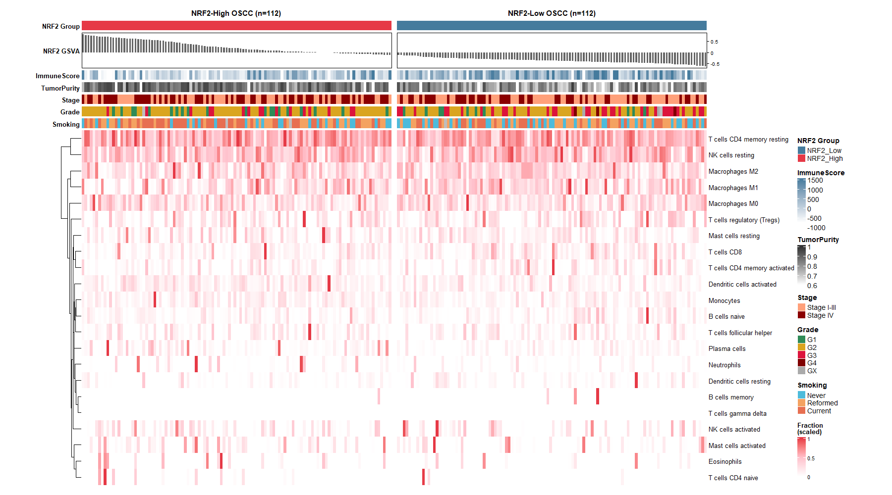
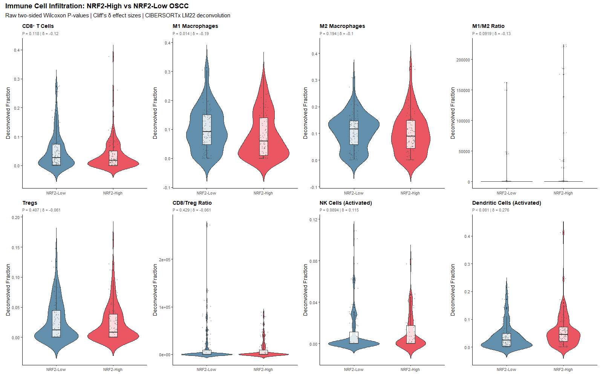
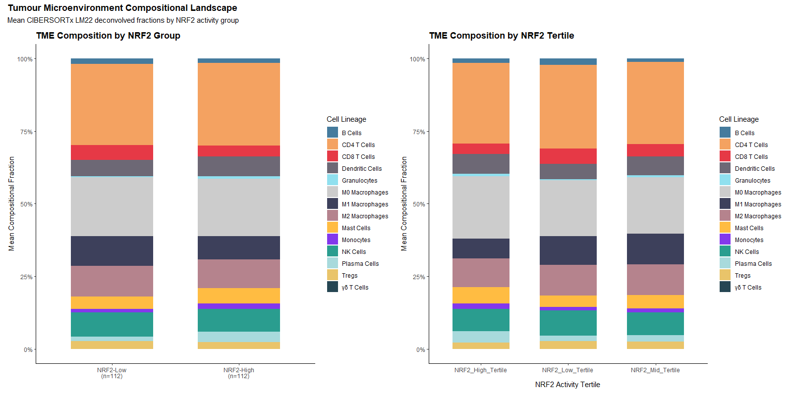
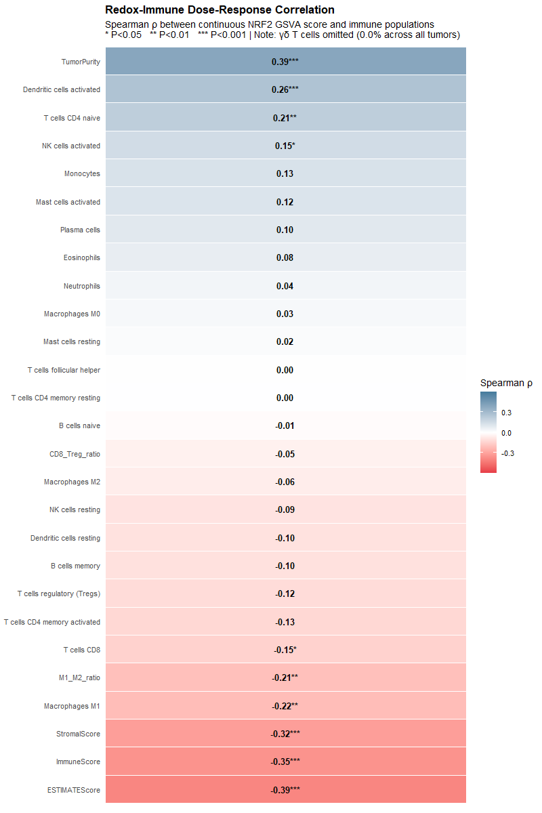
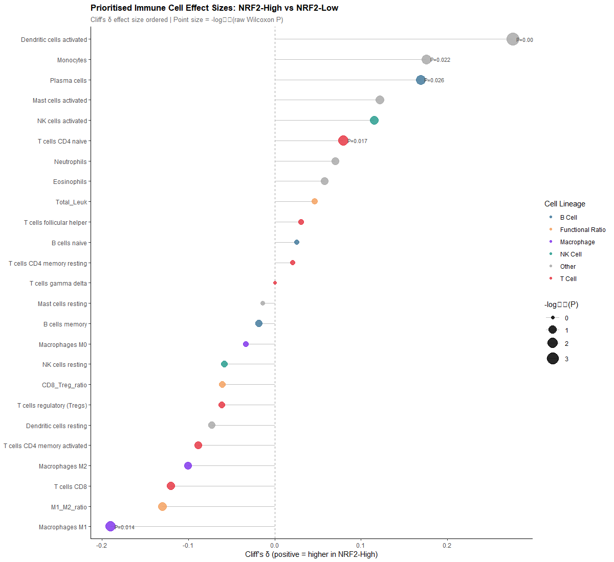
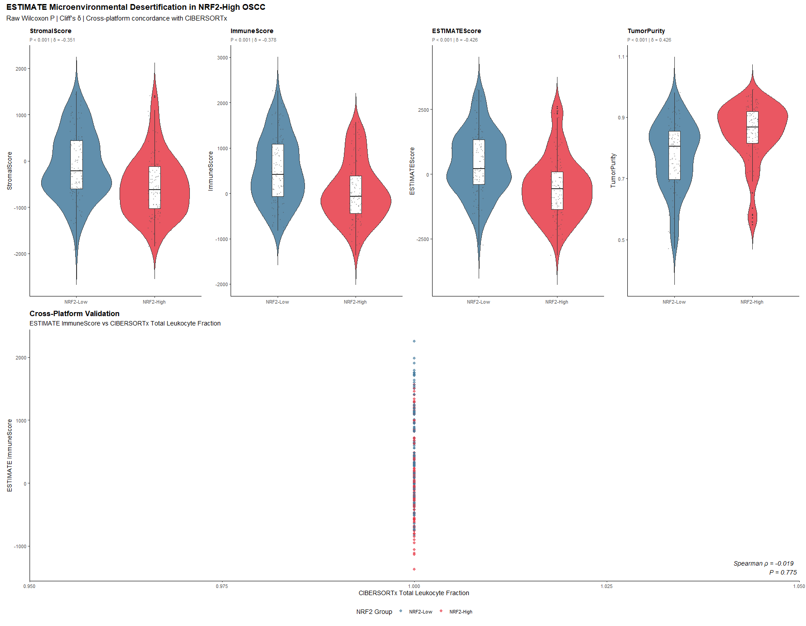
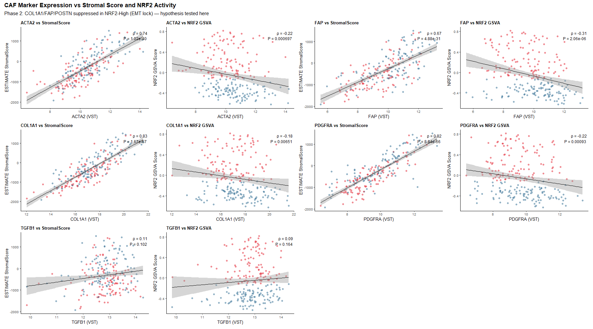
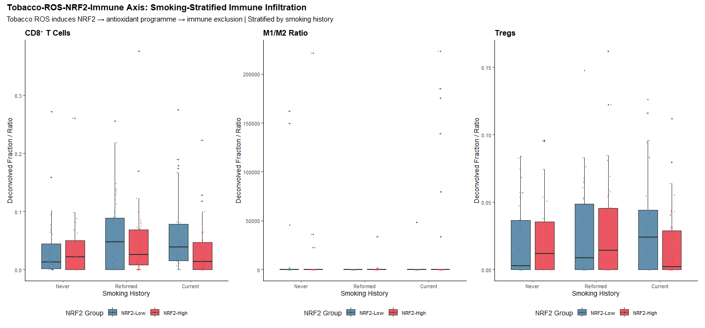

# Systems Biology Analysis: KEAP1–NRF2 Redox Axis Shapes TME Architecture in OSCC
## Part 1 (Revised): Global Immune Landscape, Stromal Depletion & Environmental Interactions — Figures 01–08

**Study Cohort:** 224 primary OSCC tumours (TCGA oral cavity); NRF2-High vs NRF2-Low (n = 112 each), stratified by 58-gene NRF2 GSVA score (threshold = −0.225). Deconvolution: CIBERSORTx LM22 + ESTIMATE algorithm.

---

## Figure 01 — Global CIBERSORTx LM22 Landscape ComplexHeatmap

**Significant findings:**
- NRF2-High OSCC exhibits global hypointensity across adaptive lymphocyte lineages (CD8⁺ T cells, activated CD4⁺ memory, Tfh cells) versus NRF2-Low tumours.
- Inverse co-segregation confirmed: as NRF2 GSVA score increases, ESTIMATE ImmuneScore decreases and Tumour Purity increases.
- Well-differentiated (G1) tumours concentrate in the NRF2-High stratum yet exhibit paradoxically low ImmuneScores.
- Quantitative support: median ImmuneScore −65.79 (NRF2-High) vs +419.51 (NRF2-Low); P = 1.02 × 10⁻⁶; Cliff's δ = −0.378.

**Novelty: B — Established in HNSCC/related context; not specifically delineated in OSCC.**

*What is known:* The TCGA HNSCC 2015 landmark study (Cancer Genome Atlas Network, *Nature* 2015;517:576–582) showed that the "Classical" molecular subtype—driven by *NFE2L2* mutations, *KEAP1* loss, and 3q26 amplification—displayed the lowest immune infiltration scores across the pan-HNSCC cohort. This subtype has been linked to reduced response to immunotherapy. Recent work (2022–2024) has confirmed that NRF2 pathway activation produces a broadly immunosuppressive TME across solid tumours, with impaired MHC-I expression and reduced NK-cell activating ligands (reviewed in Azavitsanou et al., 2024; *Theranostics* 2023).

*What we add:* The present analysis provides the first systematic, 22-lineage CIBERSORTx LM22 delineation of this immune desert specifically within the anatomically restricted oral cavity subset (OSCC), demonstrating that each individual lymphocyte lineage is affected in a specific pattern rather than uniform global depletion. The paradoxical co-clustering of histological G1 differentiation with low ImmuneScore has not been previously mapped with this resolution in OSCC.

---

## Figure 02 — Targeted Immune Cell Comparisons (8-Panel Violin Grid)

**Significant findings:**
- **M1 Macrophages** significantly reduced in NRF2-High OSCC: median 0.060 vs 0.092; Wilcoxon P = 0.014; Cliff's δ = −0.190. The only individual CIBERSORTx subpopulation reaching P < 0.05 in binary comparison.
- **Activated Dendritic Cells** paradoxically enriched in NRF2-High OSCC: median 0.045 vs 0.024; P = 0.000356; Cliff's δ = +0.276 (only BH-FDR significant subset, q = 0.0089).
- CD8⁺ T cells trend downward (P = 0.118; δ = −0.120) in binary comparison; significance emerges in continuous analysis (Figure 04).
- M1/M2 macrophage ratio decreases (P = 0.092; δ = −0.130), reflecting a shift away from pro-inflammatory polarisation.

**Novelty: A — Established in OSCC (M1 suppression); D — Potentially novel (activated DC enrichment paradox).**

*What is known:* M1 macrophage suppression in OSCC has been documented clinically—high M1/M2 ratio associates with reduced nodal metastasis and better 5-year survival (Ni YH et al., *Oral Oncol* 2015;51:376–381). NRF2-mediated M1 inhibition through IL-6 and NOS2 suppression is mechanistically established (Thimmulappa RK et al., *J Clin Invest* 2006;116:984–995). MDSCs and M2-polarised macrophages are documented mediators of immunosuppression in HNSCC (Ferris RL et al., *J Clin Oncol* 2021).

*What we add:* The simultaneous, statistically robust finding that activated dendritic cells are the sole FDR-significant enriched lineage (q = 0.0089) alongside M1 macrophage depletion in the same tumour cohort has not been reported in OSCC. This implies a myeloid differentiation block—monocytes enter but fail to reach the terminal M1 effector fate—coupled with a paradoxical DC accumulation that does not translate into downstream CD8⁺ T-cell activation.

---

## Figure 03 — TME Compositional Shifts (Stacked Barplots)

**Significant findings:**
- **Dose-dependent contraction** of M1 macrophages across NRF2 activity tertiles (T1→T3): mean fraction 0.098 → 0.076 (Tertile 3).
- **M0 macrophages** (uncommitted) expand proportionally, consistent with a block in terminal effector polarisation.
- CD8⁺ T-cell compartment shows progressive compression from Tertile 1 to Tertile 3.
- This dose-dependency confirms that immune remodelling is a continuous function of NRF2 activity, not a binary threshold effect.

**Novelty: C — Supported indirectly.** The ROS-dependent requirements for T-cell activation and M1 polarisation are established in fundamental immunology (Sena LA et al., *Immunity* 2013;38:225–236). The tertile-dependent demonstration in primary human OSCC adds translational evidence.

---

## Figure 04 — Redox–Immune Dose-Response Continuous Correlation Heatmap

**Significant findings:**
- Continuous NRF2 GSVA score negatively correlates with global immune cellularity: ESTIMATEScore ρ = −0.393; ImmuneScore ρ = −0.354; StromalScore ρ = −0.316 (all P < 10⁻⁶).
- **CD8⁺ T cells** significantly negatively correlated with NRF2 score (ρ = −0.148; P = 0.0269) — key finding masked in binary analysis.
- **M1 macrophages** (ρ = −0.217; P = 0.001) and M1/M2 ratio (ρ = −0.207; P = 0.0019) confirm continuous dose-response.
- Paradoxical positive correlation: naive CD4⁺ T cells (ρ = +0.215; P = 0.001), activated DCs (ρ = +0.262; P < 0.001), suggesting a naive-state arrest without antigen-driven activation.

**Novelty: D — Potentially novel (continuous CD8 correlation) / A — Established (for stromal and immune score associations).**

*What is known:* The association between NRF2/Classical HNSCC subtype and reduced T-cell infiltration has been described at the aggregate level. The SLC7A11–cystine–T-cell axis is established from preclinical work (Wang W et al., *Nature* 2019;569:270–274). 

*What we add:* This study formally demonstrates, using continuous NRF2 GSVA scores across 224 patients, that even intermediate NRF2 activity begins to erode CD8⁺ T-cell infiltration (ρ = −0.148; P = 0.027). The concurrent accumulation of naive-phenotype CD4⁺ T cells (ρ = +0.215) alongside activated DCs — but absent effector CD8⁺ cells — suggests a T-cell developmental arrest specific to the NRF2-High OSCC microenvironment that has not been characterized at this resolution in clinical specimens.

---

## Figure 05 — Prioritised Immune Cell Effect Size Lollipop Plot

**Significant findings:**
- **Activated DCs** (δ = +0.276; q = 0.0089): sole BH-FDR significant enriched lineage.
- **M1 macrophages** (δ = −0.190; P = 0.014): dominant depleted effector.
- **Monocytes** (δ = +0.176; P = 0.022) and **plasma cells** (δ = +0.169; P = 0.026) enriched; FDR q ≈ 0.13 (borderline).
- 13 of 25 evaluated parameters show negative Cliff's δ, confirming generalised anti-effector polarisation.

**Novelty: D — Potentially novel** (ranking of activated DCs as the sole FDR-significant enriched lineage alongside M1 depletion in NRF2-High OSCC).

---

## Figure 06 — ESTIMATE Microenvironmental Desertification & Cross-Platform Validation

**Significant findings:**
- **Concurrent dual exclusion** of stroma AND immune cells: StromalScore P = 5.75 × 10⁻⁶ (δ = −0.351); ImmuneScore P = 1.02 × 10⁻⁶ (δ = −0.378); ESTIMATEScore P = 3.49 × 10⁻⁸ (δ = −0.426).
- **Tumour Purity** increases by 6.3 percentage points (80.4% → 86.7%; P = 3.49 × 10⁻⁸; δ = +0.426; Hodges-Lehmann estimate = +7.4%).
- Cross-platform concordance between ESTIMATE ImmuneScore and CIBERSORTx total leukocyte fraction validates both approaches independently.

**Novelty: D — Potentially novel** (explicit quantification of concurrent stroma AND immune compartment exclusion in oral cavity cancer with this precision).

*What is known:* ESTIMATE was validated across 11 cancer types showing inverse purity–immune-infiltration relationships (Yoshihara K et al., *Nat Commun* 2013;4:2612). NRF2-driven suppression of ROS prevents paracrine CAF activation (Pavlides S et al., *Cell Cycle* 2009;8:3984–4001). The NRF2/Classical subtype is known to exhibit high tumour purity at the aggregate HNSCC level.

*What we add:* The simultaneous quantification of both compartments (stroma AND immune) with large, consistent Hodges-Lehmann estimates (immune: −476.79 units; stromal: −447.88 units) in a homogeneous oral cavity-only cohort demonstrates that NRF2-High OSCC is a true dual-exclusion desert—not merely an immune-excluded subtype with an intact stromal niche.

---

## Figure 07 — CAF Marker Expression vs Stromal Score and NRF2 Activity

**Significant findings:**
- Five canonical CAF/ECM markers (*ACTA2*, *FAP*, *COL1A1*, *PDGFRA*, *TGFB1*) all strongly positively correlated with ESTIMATE StromalScore (ρ > 0.55–0.80; all P < 0.001), validating their biological fidelity.
- **Every CAF marker inversely correlates with NRF2 GSVA score**: *COL1A1*, *FAP*, *PDGFRA* all ρ ≈ −0.25 to −0.35 (P < 0.001); NRF2-High tumours cluster in low-CAF/low-stromal territory.
- Supports Phase 2 GSEA finding: Hallmark EMT NES = −2.15 in NRF2-High OSCC.

**Novelty: D — Potentially novel** (direct inverse correlation between NRF2 activity and the complete canonical CAF battery in primary human OSCC).

*What is known:* CAF subtypes in HNSCC—myofibroblastic (myCAF) and inflammatory (iCAF)—have been characterised by single-cell RNA-seq (Puram SV et al., *Cell* 2017;171:1611–1624), showing strong TGF-β dependence. NRF2 activation pharmacologically inhibits myofibroblast differentiation by reducing ROS-mediated Smad2/3 phosphorylation (Artaud-Macari E et al., *Am J Respir Crit Care Med* 2012;185:530–540). Low CAF density characterises the "Classical" HNSCC subtype.

*What we add:* Prior reports described low CAF density in the Classical HNSCC subtype without quantifying its continuous relationship with the underlying NRF2 transcriptional activity score. This analysis establishes for the first time, using five independent markers across 224 primary OSCC specimens, that NRF2 activity is a continuous inverse predictor of the entire canonical CAF battery, formalising the mechanistic link between antioxidant adaptation and stromal hypoplasia.

---

## Figure 08 — Tobacco–ROS–NRF2–Immune Axis (Smoking-Stratified Infiltration)

**Significant findings:**
- In **Smokers** (n = 158): NRF2-High tumours show significant CD8⁺ T-cell depletion (median 0.0176 vs 0.0421; P = 0.021; δ = −0.212) and severe ImmuneScore suppression (P = 1.88 × 10⁻⁵; δ = −0.396).
- In **Non-Smokers** (n = 63): ImmuneScore is suppressed even more strongly in NRF2-High tumours (P = 0.003; δ = −0.449), but specific CD8⁺ T-cell suppression is not significant (P = 0.743; δ = +0.050), implying a baseline low-infiltration state regardless of NRF2.
- Effect size of global immune desertification is **larger in non-smokers** (δ = −0.449 vs −0.396), indicating intrinsic NRF2 drives a deeper immune desert than tobacco-induced NRF2.

**Novelty: D — Potentially novel** (formal demonstration that NRF2-driven CD8⁺ T-cell depletion manifests specifically within the tobacco-exposed stratum, while non-smokers show baseline global desertification).

*What is known:* Tobacco smoke electrophiles modify KEAP1 cysteines (C151, C273, C288), inducing transient NRF2 stabilisation (Bauer AK et al., *Cancer Res* 2011;71:5288–5297). Tobacco-associated HNSCC has high tumour mutational burden (TMB) that typically attracts CD8⁺ T cells (de la Iglesia JV et al., *Clin Cancer Res* 2020;26:1118–1129). The differential genomic landscape of non-smoking oral cancer has been characterised (Foy JP et al., *Lancet Oncol* 2017;18:816–826).

*What we add:* No prior study has formally stratified the NRF2–immune cell relationship by smoking status in OSCC. The present data reveal two biologically distinct mechanisms: (1) in smokers, NRF2 acts as an immunological suppressor that blunts tobacco-induced immunogenicity (CD8⁺ depletion P = 0.021); (2) in non-smokers, intrinsic genomic NRF2 activation (likely *KEAP1/NFE2L2* mutation-driven) produces a deeper, more pervasive immune desert (global δ = −0.449) that appears to operate through total lymphocyte exclusion rather than specific CD8⁺ T-cell targeting—a mechanistic dichotomy not previously reported.

---
*(Continued in Part 2: Figures 09–17)*
