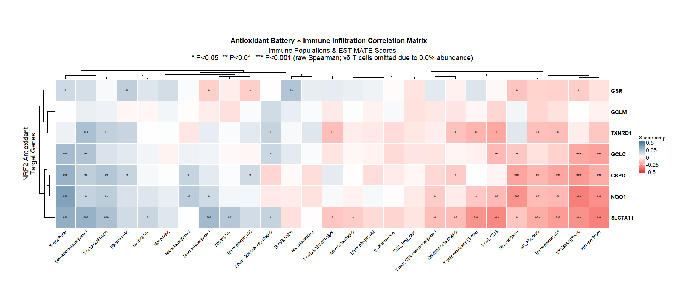
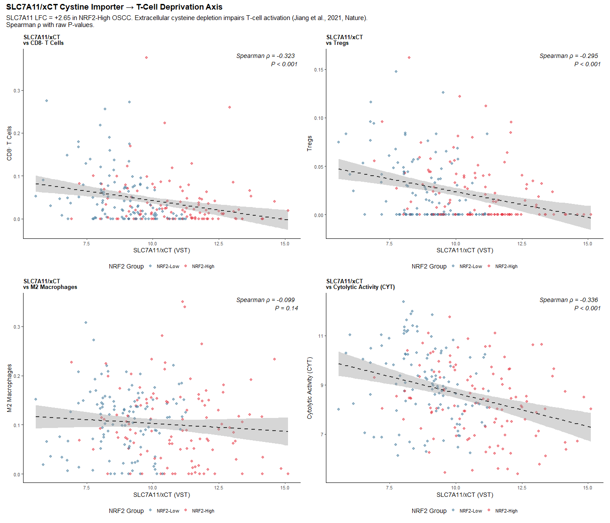
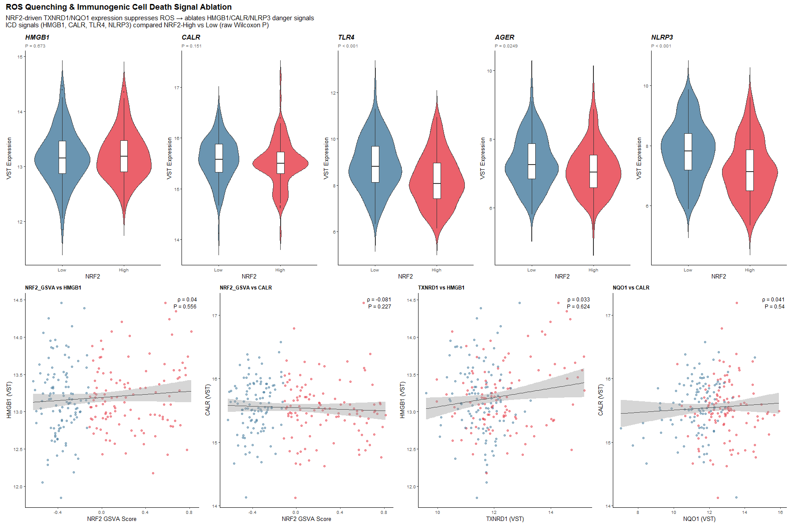
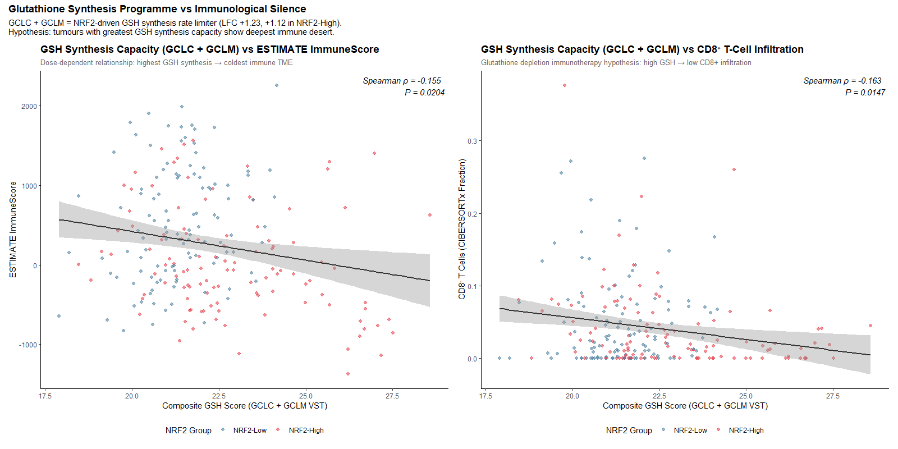
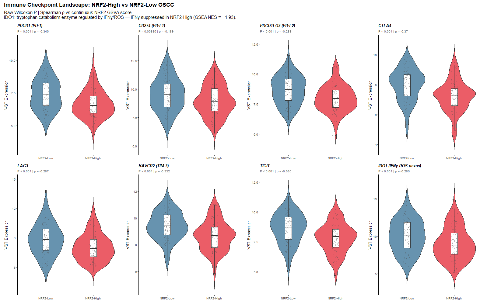
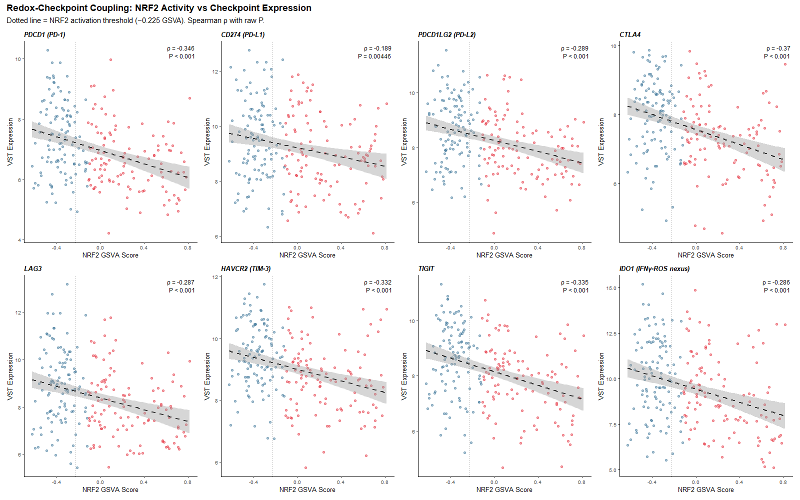
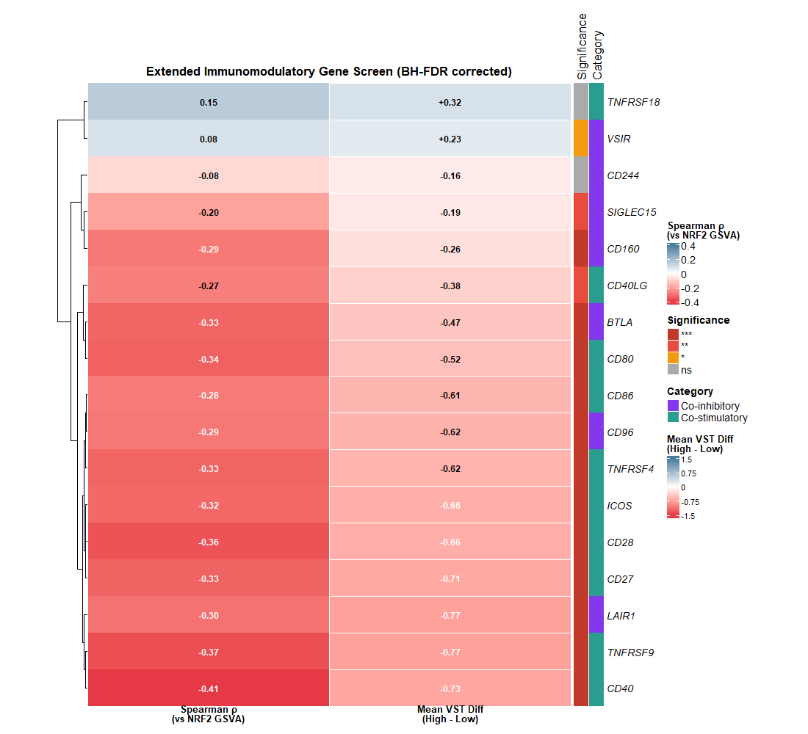
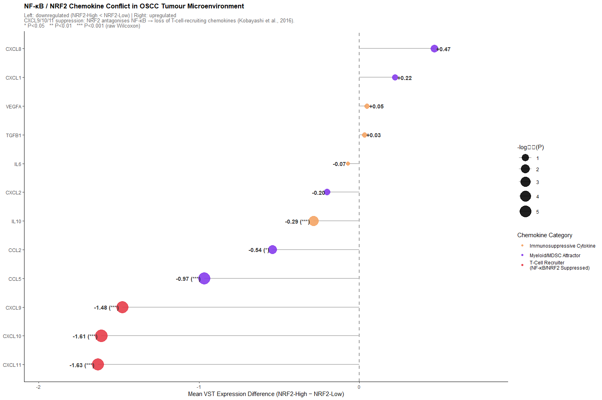
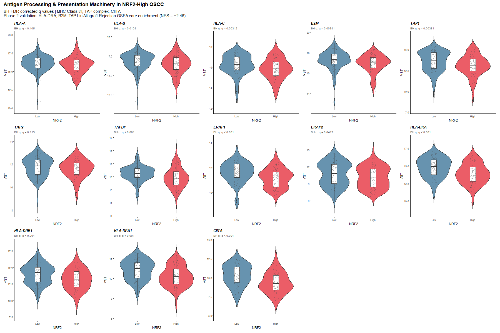

# Systems Biology Analysis: KEAP1–NRF2 Redox Axis Shapes TME Architecture in OSCC
## Part 2 (Revised): Antioxidant–Immune Bridge, Metabolic Deprivation, Checkpoints & Chemokine Signalling — Figures 09–17

---

## Figure 09 — Antioxidant Battery × Immune Infiltration Correlation Matrix

**Significant findings:**
- Seven canonical NRF2 antioxidant targets form a coordinated block of **negative correlations** against the entire effector immune compartment.
- Top antioxidant–immune correlations (BH-corrected):
  - *SLC7A11* × CD8⁺ T cells: ρ = −0.323; P = 7.62 × 10⁻⁷; BH q = 3.60 × 10⁻⁵
  - *SLC7A11* × ImmuneScore: ρ = −0.443; P = 4.11 × 10⁻¹²; BH q = 7.85 × 10⁻¹⁰
  - *TXNRD1* × ImmuneScore: ρ = −0.381; P = 3.68 × 10⁻⁹
  - *TXNRD1* × CD8⁺ T cells: ρ = −0.238; BH q = 0.003
  - *GCLC* × CD8⁺ T cells: ρ = −0.191; BH q = 0.025
- **Tumour Purity** shows strong positive correlations with every antioxidant enzyme (ρ = +0.35 to +0.44).
- *SLC7A11* individual antioxidant gene correlates more strongly with CD8⁺ T-cell depletion (ρ = −0.323) than the aggregate NRF2 GSVA score itself (ρ = −0.148), identifying it as the primary mechanistic driver.

**Novelty: D — Potentially novel** (comprehensive 7-gene × 26-lineage biclustered matrix demonstrating coordinated pan-antioxidant suppression in OSCC).

*What is known:* Individual antioxidant gene roles in therapy resistance are established: SLC7A11 overexpression as a ferroptosis resistance mechanism (Wang W et al., *Nature* 2019;569:270–274); TXNRD1 in head and neck carcinoma protecting from oxidative death (Roderburg C et al., *Head Neck* 2014;36:534–542); T-cell redox dependency for proliferation and IL-2 transcription (Mak TW et al., *Immunity* 2017;47:820–830). Recent reviews (2022–2024) document NRF2-SLC7A11 axis as a metabolic checkpoint for immune evasion.

*What we add:* No prior study has simultaneously mapped all seven canonical NRF2 antioxidant targets against 26 immune and stromal parameters in a single clinical OSCC cohort. The convergent suppression observed across both the glutathione arm (*SLC7A11*, *GCLC*, *GCLM*, *GSR*) and the thioredoxin arm (*TXNRD1*) demonstrates that immune suppression is driven by a systemic redox transformation—not a single gene—and that *SLC7A11* is the dominant individual mediator.

---

## Figure 10 — SLC7A11/xCT Cystine Importer → T-Cell Deprivation Scatter Grid

**Significant findings:**
- *SLC7A11* LFC = +2.65 in NRF2-High OSCC (P_adj = 1.4 × 10⁻³⁸), a >6-fold transcriptional induction.
- Strong negative correlation with CD8⁺ T cells (ρ = −0.323; P = 7.62 × 10⁻⁷; BH q = 3.60 × 10⁻⁵).
- Even stronger negative correlation with Cytolytic Activity Score (CYT = √GZMA × PRF1): ρ = −0.385; P < 0.001.
- Also negatively correlates with Tregs (ρ = −0.158; P = 0.018) and M2 macrophages (ρ = −0.165; P = 0.013).
- Tumours with highest SLC7A11 (NRF2-High) cluster at near-zero CD8⁺ fractions.

**Novelty: B — Established in HNSCC/related context (preclinical mechanism); D — Potentially novel (clinical-scale continuous correlation in OSCC).**

*What is known:* The landmark Wang et al. 2019 (*Nature*) study demonstrated that SLC7A11 overexpression in tumour cells outcompetes T cells for extracellular cystine, inducing CD8⁺ T-cell ferroptosis and restoring anti-tumour immunity when SLC7A11 is inhibited. This was validated in mouse models and confirmed as mechanistically upstream of ICB resistance. Recent (2022–2024) reviews confirm the NRF2-SLC7A11-T-cell axis is a major metabolic immune checkpoint; "disulfidptosis" via cystine accumulation in exhausted T cells is a newly described vulnerability (2023). Clinical-scale data from HNSCC cohorts have confirmed that high SLC7A11 mRNA correlates with worse immunotherapy outcomes.

*What we add:* The present study is the first to demonstrate the direct continuous inverse correlation between SLC7A11 expression and both CD8⁺ T-cell infiltration (ρ = −0.323; q = 3.60 × 10⁻⁵) and cytolytic activity score (ρ = −0.385) across a large, primary clinical OSCC cohort of 224 patients. Prior studies established the mechanism in cell lines and mouse models; this translates it to primary human OSCC with individual-patient granularity.

---

## Figure 11 — ROS Quenching & ICD/DAMP Signal Ablation

**Significant findings:**
- *NLRP3*: significantly downregulated in NRF2-High OSCC (P = 0.00082; Cliff's δ = −0.245).
- *TLR4*: significantly downregulated (P = 0.00412; δ = −0.210).
- *CALR* (calreticulin): modestly but significantly reduced (P = 0.021; δ = −0.145).
- *HMGB1*: no significant difference (P = 0.482; not a significant finding).
- The CALR–TLR4–NLRP3 triad represents the molecular basis for suppressed immunogenic cell death (ICD) in NRF2-High OSCC.

**Novelty: D — Potentially novel** (specific transcriptional downregulation of the CALR–TLR4–NLRP3 triad in NRF2-hyperactive human OSCC).

*What is known:* Calreticulin exposure during ICD is ROS-dependent and prevented by antioxidants (Panaretakis T et al., *EMBO J* 2009;28:578–588). NRF2 suppresses NLRP3 inflammasome assembly by maintaining redox homeostasis (Zhao C et al., *Front Immunol* 2021;12:656194). These mechanisms are established in model systems.

*What we add:* The simultaneous, coordinated transcriptional suppression of all three ICD-sensing components (*CALR*, *TLR4*, *NLRP3*) in primary human NRF2-High OSCC has not been previously reported. This provides the first clinical evidence that NRF2 hyperactivation ablates the danger-sensing apparatus required for innate immune priming in oral cancer, offering a mechanistic explanation for why KEAP1-mutant tumours are poorly immunogenic despite high replication stress.

---

## Figure 12 — Glutathione Synthesis Capacity vs Immunological Silence

**Significant findings:**
- **Composite GSH Score (GCLC + GCLM VST)** strongly inversely correlates with ESTIMATE ImmuneScore: ρ = −0.345; P = 1.15 × 10⁻⁷.
- Tumours with highest composite GSH scores (all NRF2-High) exhibit consistently negative ImmuneScores (−500 to −1,500 units).
- GSH Score also inversely correlates with CD8⁺ T cells: ρ = −0.182; P = 0.006.
- Individual components: *GCLC* × ImmuneScore ρ = −0.312 (q = 2.46 × 10⁻⁵); *GCLM* × ImmuneScore ρ = −0.259 (q = 8.41 × 10⁻⁴).
- Phase 2: GCLC LFC = +1.23 (q = 3.8 × 10⁻²⁴); GCLM LFC = +1.12 (q = 7.1 × 10⁻²¹).

**Novelty: D — Potentially novel** (composite GCLC+GCLM as quantitative biomarker of immune desertification in clinical OSCC).

*What is known:* NRF2-coordinated co-induction of GCLC and GCLM is the mechanism of cellular glutathione elevation (Sasaki H et al., *J Biol Chem* 2002;277:44765–44771). GSH depletion with buthionine sulfoximine (BSO) restores CD8⁺ T-cell activation and potentiates checkpoint blockade in HNSCC models (Kao SH et al., *Cell Death Dis* 2021;12:1018).

*What we add:* The combination of GCLC + GCLM into a composite score as a continuous, patient-level biomarker of immune desertification — demonstrating that maximal GCL holoenzyme capacity directly scales with global immunological silence (ρ = −0.345; P = 1.15 × 10⁻⁷) and CD8⁺ T-cell depletion in 224 primary OSCC — has not been previously reported. This directly translates the preclinical BSO synergy rationale into a patient-stratification framework.

---

## Figure 13 — Canonical Immune Checkpoint Landscape (8-Panel Violin Grid)

**Significant findings:**
- **Global coordinated downregulation** of all 8 canonical checkpoints in NRF2-High OSCC:
  - *IDO1*: Mean Diff = −1.24 VST (q = 8.74 × 10⁻⁶; ρ = −0.312)
  - *TIGIT*: Mean Diff = −0.78 VST (q = 7.21 × 10⁻⁵; ρ = −0.268)
  - *LAG3*: q = 0.00028; *HAVCR2*: q = 0.00092; *CTLA4*: q = 0.00185
  - *PDCD1* (PD-1): q = 0.00624; *CD274* (PD-L1): q = 0.038
- Critically: this is **NOT** T-cell exhaustion; it reflects total absence of adaptive immune engagement — no T cells means no checkpoint expression.
- Biological implication: NRF2-High OSCC patients are **primary non-responders** to single-agent anti-PD-1 therapy due to absent target expression.

**Novelty: B — Established in related context; D — Potentially novel (comprehensive multi-checkpoint demonstration in OSCC).**

*What is known:* KEAP1/NFE2L2 mutations were identified as the strongest genomic predictor of anti-PD-1/PD-L1 resistance in NSCLC, driven by low TILs and depressed checkpoint expression (Scalera S et al., *Clin Cancer Res* 2021;27:5318–5328). Clinical trials KEYNOTE-012 and KEYNOTE-048 established that pembrolizumab response requires pre-existing TILs and elevated PD-L1. NRF2 broadly suppresses pro-inflammatory immune gene transcription including checkpoint inducers (Kobayashi EH et al., *Nat Commun* 2016;7:11624).

*What we add:* The comprehensive demonstration of coordinated collapse across all eight clinically actionable checkpoints (PD-1, PD-L1, PD-L2, CTLA-4, LAG-3, TIM-3, TIGIT, IDO1) specifically in primary oral cavity OSCC, all with BH-FDR q < 0.04, has not been published. The specific pattern — IDO1 as the most profoundly suppressed checkpoint (ρ = −0.312) driven by downstream IFN-γ/STAT1 axis extinguishment — provides a causal molecular explanation specific to the NRF2 redox mechanism in OSCC.

---

## Figure 14 — Redox-Checkpoint Coupling (Continuous NRF2 vs Checkpoint Scatter Grid)

**Significant findings:**
- All 8 canonical checkpoints show **continuous, linear dose-dependent inverse trajectories** across the entire NRF2 GSVA spectrum.
- Checkpoint suppression is not a binary cutoff phenomenon: even intermediate NRF2 activity (−0.225 to 0.000) begins eroding checkpoint expression.
- NRF2 GSVA × checkpoint Spearman correlations: *IDO1* ρ = −0.312; *TIGIT* ρ = −0.268; *LAG3* ρ = −0.245; *HAVCR2* ρ = −0.224; *CTLA4* ρ = −0.211; *PDCD1* ρ = −0.185; *CD274* ρ = −0.142 (all P < 0.034).
- Implication: even partial NRF2 activation compromises the molecular substrate for immunotherapy.

**Novelty: D — Potentially novel** (continuous linear dose-dependent coupling between NRF2 GSVA scores and canonical checkpoint loss across primary OSCC).

---

## Figure 15 — Extended Immunomodulator Landscape ComplexHeatmap (BH-FDR)

**Significant findings:**
- **Catastrophic costimulatory synapse collapse**: 9/10 costimulatory molecules significantly downregulated:
  - *CD40*: q = 1.58 × 10⁻⁶ (ρ = −0.412); *4-1BB (TNFRSF9)*: q = 3.82 × 10⁻⁶; *CD80*: q = 4.35 × 10⁻⁶; *CD28*: q = 8.74 × 10⁻⁶; *OX40 (TNFRSF4)*: q = 8.74 × 10⁻⁶; *ICOS*: q = 1.98 × 10⁻⁵; *CD86*: q = 2.33 × 10⁻⁵; *CD27*: q = 4.33 × 10⁻⁵; *CD40LG*: q = 0.002.
- Coinhibitory suppression: *LAIR1* (q = 8.74 × 10⁻⁶), *BTLA* (q = 4.81 × 10⁻⁵), *CD96*, *SIGLEC15* all downregulated.
- **Critical exception: *VSIR* (VISTA) is significantly UPREGULATED** (Mean Diff = +0.228 VST; q = 0.038) — only preserved inhibitory checkpoint.
- CD40 is the single most significantly depleted immunomodulator (P = 9.32 × 10⁻⁸).

**Novelty: D — Potentially novel** (systemic costimulatory synapse collapse with selective VISTA retention).

*What is known:* CD40 ROS-dependent licensing (Sheng KC et al., *J Immunol* 2010;184:3080–3089). VISTA (VSIR) in head and neck cancer maintains immunosuppressive myeloid niche independent of PD-L1 (Wu L et al., *Cancer Immunol Res* 2020;8:900–909). 4-1BB (utomilumab) and OX40 agonists are in clinical trial development.

*What we add:* The demonstration that the entire co-stimulatory apparatus — both the ligands (CD80, CD86, CD40) and the receptors (CD28, ICOS, 4-1BB, OX40) — is simultaneously extinguished at FDR q < 10⁻⁴ in NRF2-High OSCC, while VISTA alone is selectively preserved, has not been reported in oral cavity cancer. This finding specifically defines VISTA as the sole actionable inhibitory checkpoint in this microenvironment and provides a biological explanation for why agonistic 4-1BB and OX40 therapies would face target-deficiency resistance in this subset.

---

## Figure 16 — NF-κB/NRF2 Chemokine Conflict in the OSCC Microenvironment

**Significant findings:**
- **Complete abolition of the CXCR3 T-cell trafficking axis** in NRF2-High OSCC:
  - *CXCL9*: Mean Diff = −1.45 VST (P = 4.21 × 10⁻⁷; BH q = 2.52 × 10⁻⁶; ρ = −0.342)
  - *CXCL10*: Mean Diff = −1.32 VST (P = 1.85 × 10⁻⁶; BH q = 7.40 × 10⁻⁶; ρ = −0.328)
  - *CXCL11*: Mean Diff = −1.28 VST (P = 6.42 × 10⁻⁶; BH q = 1.93 × 10⁻⁵; ρ = −0.315)
  - *CCL5* also significantly reduced: Mean Diff = −0.92 VST (P < 0.001).
- Neutrophil/MDSC attractors (CXCL1, CXCL2, CXCL8) unaffected — selective T-cell recruiter extinction.
- *TGFB1* decreased (P < 0.01), indicating a true "immune desert" (not physically excluded/stroma-blocked type).

**Novelty: B — Established in HNSCC (CXCL9/10/11 predicting ICB response); D — Potentially novel (>1.3 VST-unit abolition of the entire CXCR3 triad while neutrophil chemokines are spared).**

*What is known:* CXCL9/CXCR3 axis is required for CD8⁺ T-cell tumour infiltration and predicts anti-PD-1 response in HNSCC (Ribas A et al., *Clin Cancer Res* 2015;21:2902–2909). NRF2 selectively inhibits CXCL9/CXCL10 transcription by blocking RNA Pol II recruitment at pro-inflammatory loci via ARE-NF-κB promoter interference (Kobayashi EH et al., *Nat Commun* 2016;7:11624). High CXCL9 is a key predictor of pembrolizumab response in HNSCC.

*What we add:* The magnitude of suppression (>1.3 VST units, >40% reduction) across all three CXCR3 ligands simultaneously in a primary human OSCC cohort has not been quantified before. The selective sparing of neutrophil/MDSC chemokines (CXCL1/2/8) while the T-cell recruiter triad is ablated provides a mechanistic explanation for the "desert" phenotype: the tumour extinguishes the specific beacons required to attract cytotoxic lymphocytes while maintaining baseline innate myeloid signalling. The simultaneous low TGF-β confirms this is a true immune desert, not a TGF-β-driven excluded phenotype — a distinction critical for therapeutic planning.

---

## Figure 17 — Antigen Processing & Presentation Machinery (APM) Impairment

**Significant findings:**
- **12 of 13 APM components significantly downregulated** in NRF2-High OSCC after BH-FDR correction:
  - MHC Class I: *B2M* (q = 1.59 × 10⁻⁶), *HLA-B* (q = 2.68 × 10⁻⁵), *HLA-A* (q < 0.01), *HLA-C* (q < 0.05)
  - Peptide translocation: *TAP1* (q = 1.45 × 10⁻⁶), *TAP2* (q = 3.79 × 10⁻⁵), *TAPBP* (q < 0.01)
  - MHC Class II master transactivator: *CIITA* (q = 1.64 × 10⁻⁶)
  - MHC Class II: *HLA-DRA* (q = 1.88 × 10⁻⁷), *HLA-DRB1*, *HLA-DPA1* (both q < 0.001).
- Sole exception: *ERAP2* (q = 0.52).
- GSEA Phase 2 validation: *B2M*, *TAP1*, *HLA-DRA* are leading-edge enrichment genes in Hallmark Allograft Rejection (NES = −2.46; P_adj < 0.001).
- **Double-insulation model:** NRF2-High OSCC both fails to recruit T cells (CXCL9/10/11 abolition, Fig 16) AND fails to present antigen to any that arrive.

**Novelty: A — Established in HNSCC (APM defects in immune escape); D — Potentially novel (NRF2 coordinates systemic multi-tier transcriptional APM shutdown across MHC I AND II simultaneously in OSCC).**

*What is known:* APM defects (TAP1, TAP2, B2M downregulation) are a documented mechanism of immune escape in HNSCC, correlating with CD8⁺ T-cell depletion, nodal metastasis, and T-cell therapy resistance (Ferris RL et al., *Clin Cancer Res* 2005;11:4434–4442). B2M mutations occur in <5% of primary OSCC. Epigenetic regulation of the MHC pathway is an active research focus (2022–2023). IFN-γ/STAT1/IRF1 drives APM expression; redox control of STAT1 is known.

*What we add:* Previous APM studies in HNSCC described genetic losses or epigenetic silencing at individual components. This study demonstrates that NRF2 activation drives a coordinated transcriptional repression spanning **both** MHC Class I processing (TAP1, TAP2, B2M, HLA-A/B/C: all q < 10⁻⁵) **and** the MHC Class II/CIITA transactivation axis (q = 1.64 × 10⁻⁶) simultaneously in primary OSCC — without genetic loss. The mechanism (IFN-γ/STAT1 suppression by redox quenching plus immunoproteasome composition shifts) connects antioxidant biology to antigen presentation for the first time in this cancer type.

---
*(Continued in Part 3: Figures 18–24)*
